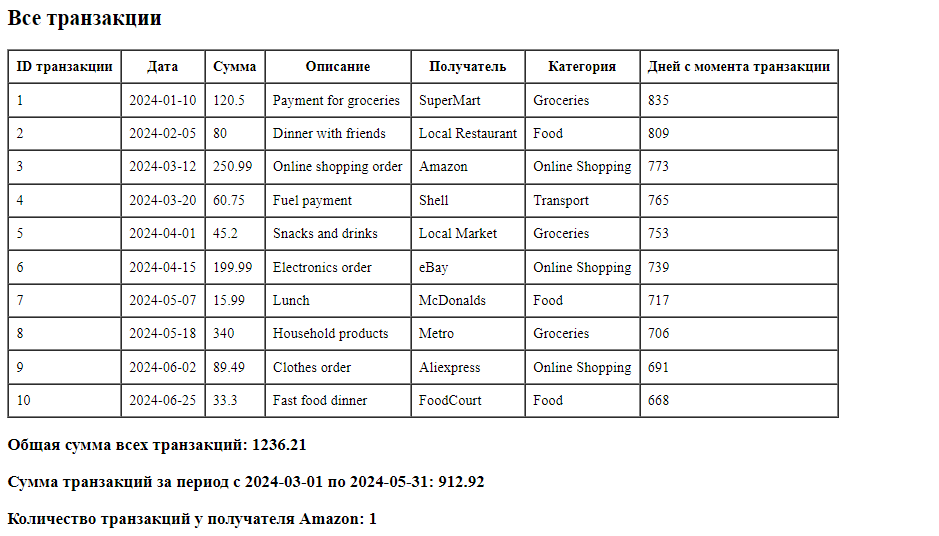

# Лабораторная работа №5
## Дисциплина: PHP

### Тема: Объектно-ориентированное программирование в PHP

Выполнил: студент группы IA2403, Демченко Юрий  
Проверила: V. Vișnevschi  
Год: 2026

* * *

## Цель работы

Освоить основы объектно-ориентированного программирования в PHP на практике.  
Научиться создавать собственные классы, использовать инкапсуляцию для защиты данных, разделять ответственность между классами, а также применять интерфейсы для построения более гибкой архитектуры приложения.

## Условия работы

В рамках лабораторной работы необходимо разработать приложение для управления банковскими транзакциями.

Приложение должно позволять:

* хранить банковские транзакции;
* добавлять новые транзакции;
* удалять транзакции;
* искать транзакции;
* сортировать транзакции;
* выполнять вычисления над коллекцией транзакций;
* выводить данные в виде HTML-таблицы.

Также в работе необходимо использовать:

* строгую типизацию;
* классы и объекты;
* приватные свойства;
* конструкторы;
* getter-методы;
* интерфейс;
* PHPDoc-комментарии;
* работу с датами через `DateTime`.

## Ход работы

### Задание 1. Включение строгой типизации

В начале файла `index.php` была включена строгая типизация:

```php
<?php

declare(strict_types=1);
```

Строгая типизация нужна для того, чтобы PHP проверял типы данных более строго.  
Например, если метод ожидает число типа `int`, а ему передать строку, то PHP сможет обнаружить ошибку.

Это помогает сделать код более надежным и понятным.

---

### Задание 2. Создание класса `Transaction`

Для описания одной банковской транзакции был создан класс `Transaction`.

Класс содержит следующие приватные свойства:

* `id` — уникальный идентификатор транзакции;
* `date` — дата транзакции;
* `amount` — сумма транзакции;
* `description` — описание платежа;
* `merchant` — получатель платежа.

Все свойства являются приватными, поэтому к ним нельзя обратиться напрямую извне класса.  
Для получения значений используются getter-методы.

Также был реализован метод `getDaysSinceTransaction(): int`, который возвращает количество дней с момента транзакции до текущей даты.

#### Пример кода

```php
class Transaction
{
    public function __construct(
        private int $id,
        private string $date,
        private float $amount,
        private string $description,
        private string $merchant
    ) {
    }

    public function getId(): int
    {
        return $this->id;
    }

    public function getDate(): string
    {
        return $this->date;
    }

    public function getAmount(): float
    {
        return $this->amount;
    }

    public function getDescription(): string
    {
        return $this->description;
    }

    public function getMerchant(): string
    {
        return $this->merchant;
    }

    public function getDaysSinceTransaction(): int
    {
        $transactionDate = new DateTime($this->date);
        $currentDate = new DateTime();

        return $transactionDate->diff($currentDate)->days;
    }
}
```

В данном классе каждая транзакция хранится как отдельный объект.  
Это удобнее, чем обычный массив, потому что данные и методы для работы с ними находятся в одном месте.

---

### Задание 3. Создание интерфейса `TransactionStorageInterface`

Для того чтобы сделать архитектуру приложения более гибкой, был создан интерфейс `TransactionStorageInterface`.

Интерфейс описывает методы, которые должен реализовать класс для хранения транзакций.

#### Пример кода

```php
interface TransactionStorageInterface
{
    public function addTransaction(Transaction $transaction): void;

    public function removeTransactionById(int $id): void;

    public function getAllTransactions(): array;

    public function findById(int $id): ?Transaction;
}
```

Интерфейс не содержит реализацию методов.  
Он только указывает, какие методы должны быть в классе.

Это позволяет в будущем заменить способ хранения транзакций. Например, вместо массива можно будет использовать базу данных, но остальные классы приложения почти не придется менять.

---

### Задание 4. Создание класса `TransactionRepository`

Класс `TransactionRepository` отвечает за хранение транзакций и базовые операции с ними.

Он реализует интерфейс `TransactionStorageInterface`.

В этом классе был создан приватный массив `$transactions`, в котором хранятся объекты класса `Transaction`.

Класс выполняет следующие действия:

* добавляет транзакцию;
* удаляет транзакцию по идентификатору;
* возвращает список всех транзакций;
* ищет транзакцию по `id`.

#### Пример кода

```php
class TransactionRepository implements TransactionStorageInterface
{
    private array $transactions = [];

    public function addTransaction(Transaction $transaction): void
    {
        $this->transactions[] = $transaction;
    }

    public function removeTransactionById(int $id): void
    {
        foreach ($this->transactions as $key => $transaction) {
            if ($transaction->getId() === $id) {
                unset($this->transactions[$key]);
            }
        }

        $this->transactions = array_values($this->transactions);
    }

    public function getAllTransactions(): array
    {
        return $this->transactions;
    }

    public function findById(int $id): ?Transaction
    {
        foreach ($this->transactions as $transaction) {
            if ($transaction->getId() === $id) {
                return $transaction;
            }
        }

        return null;
    }
}
```

Метод `addTransaction()` добавляет новый объект транзакции в массив.

Метод `removeTransactionById()` удаляет транзакцию по ее идентификатору.

Метод `getAllTransactions()` возвращает весь список транзакций.

Метод `findById()` ищет транзакцию по `id`. Если транзакция найдена, метод возвращает объект `Transaction`. Если транзакция не найдена, возвращается `null`.

---

### Задание 5. Создание класса `TransactionManager`

Класс `TransactionManager` отвечает за бизнес-логику приложения.

Он не хранит транзакции самостоятельно.  
Для получения данных он использует объект, который реализует интерфейс `TransactionStorageInterface`.

Объект репозитория передается через конструктор:

```php
public function __construct(
    private TransactionStorageInterface $repository
) {
}
```

В классе были реализованы следующие методы:

* `calculateTotalAmount()` — вычисляет общую сумму всех транзакций;
* `calculateTotalAmountByDateRange()` — вычисляет сумму транзакций за определенный период;
* `countTransactionsByMerchant()` — считает количество транзакций по конкретному получателю;
* `sortTransactionsByDate()` — сортирует транзакции по дате;
* `sortTransactionsByAmountDesc()` — сортирует транзакции по сумме по убыванию.

#### Пример кода

```php
class TransactionManager
{
    public function __construct(
        private TransactionStorageInterface $repository
    ) {
    }

    public function calculateTotalAmount(): float
    {
        $total = 0;

        foreach ($this->repository->getAllTransactions() as $transaction) {
            $total += $transaction->getAmount();
        }

        return $total;
    }

    public function calculateTotalAmountByDateRange(string $startDate, string $endDate): float
    {
        $total = 0;

        $start = new DateTime($startDate);
        $end = new DateTime($endDate);

        foreach ($this->repository->getAllTransactions() as $transaction) {
            $transactionDate = new DateTime($transaction->getDate());

            if ($transactionDate >= $start && $transactionDate <= $end) {
                $total += $transaction->getAmount();
            }
        }

        return $total;
    }

    public function countTransactionsByMerchant(string $merchant): int
    {
        $count = 0;

        foreach ($this->repository->getAllTransactions() as $transaction) {
            if ($transaction->getMerchant() === $merchant) {
                $count++;
            }
        }

        return $count;
    }

    public function sortTransactionsByDate(): array
    {
        $transactions = $this->repository->getAllTransactions();

        usort($transactions, function (Transaction $a, Transaction $b): int {
            return strtotime($a->getDate()) <=> strtotime($b->getDate());
        });

        return $transactions;
    }

    public function sortTransactionsByAmountDesc(): array
    {
        $transactions = $this->repository->getAllTransactions();

        usort($transactions, function (Transaction $a, Transaction $b): int {
            return $b->getAmount() <=> $a->getAmount();
        });

        return $transactions;
    }
}
```

Главная идея этого класса заключается в том, что он не занимается хранением данных.  
Он только получает данные из репозитория и выполняет над ними нужные операции.

Такое разделение делает код более понятным и удобным для изменения.

---

### Задание 6. Создание класса `TransactionTableRenderer`

Для вывода транзакций в HTML-таблицу был создан отдельный класс `TransactionTableRenderer`.

Этот класс отвечает только за отображение данных.  
Он не занимается вычислениями, добавлением или удалением транзакций.

Класс был объявлен как `final`, потому что его не планируется наследовать.

#### Пример кода

```php
final class TransactionTableRenderer
{
    public function render(array $transactions): string
    {
        $html = '<table border="1" cellpadding="8" cellspacing="0">';
        $html .= '<thead>';
        $html .= '<tr>';
        $html .= '<th>ID</th>';
        $html .= '<th>Дата</th>';
        $html .= '<th>Сумма</th>';
        $html .= '<th>Описание</th>';
        $html .= '<th>Получатель</th>';
        $html .= '<th>Категория</th>';
        $html .= '<th>Дней с момента транзакции</th>';
        $html .= '</tr>';
        $html .= '</thead>';
        $html .= '<tbody>';

        foreach ($transactions as $transaction) {
            $html .= '<tr>';
            $html .= '<td>' . $transaction->getId() . '</td>';
            $html .= '<td>' . $transaction->getDate() . '</td>';
            $html .= '<td>' . $transaction->getAmount() . '</td>';
            $html .= '<td>' . $transaction->getDescription() . '</td>';
            $html .= '<td>' . $transaction->getMerchant() . '</td>';
            $html .= '<td>' . $this->getMerchantCategory($transaction->getMerchant()) . '</td>';
            $html .= '<td>' . $transaction->getDaysSinceTransaction() . '</td>';
            $html .= '</tr>';
        }

        $html .= '</tbody>';
        $html .= '</table>';

        return $html;
    }

    private function getMerchantCategory(string $merchant): string
    {
        return match ($merchant) {
            'SuperMart' => 'Продукты',
            'Local Restaurant' => 'Ресторан',
            'Amazon' => 'Покупки',
            'Netflix' => 'Развлечения',
            'Shell' => 'Транспорт',
            default => 'Другое',
        };
    }
}
```

Метод `render()` получает массив транзакций и возвращает готовую строку с HTML-кодом таблицы.

В основном файле остается только вызвать метод `render()` и вывести результат через `echo`.

---

### Задание 7. Создание начальных данных

Для проверки работы приложения было создано 10 объектов класса `Transaction`.

Каждая транзакция имеет разные данные:

* дату;
* сумму;
* описание;
* получателя платежа.

#### Пример кода

```php
$repository = new TransactionRepository();

$repository->addTransaction(new Transaction(1, '2024-01-10', 150.50, 'Payment for groceries', 'SuperMart'));
$repository->addTransaction(new Transaction(2, '2024-02-15', 75.00, 'Dinner with friends', 'Local Restaurant'));
$repository->addTransaction(new Transaction(3, '2024-03-20', 220.30, 'Online shopping', 'Amazon'));
$repository->addTransaction(new Transaction(4, '2024-04-05', 12.99, 'Monthly subscription', 'Netflix'));
$repository->addTransaction(new Transaction(5, '2024-05-11', 60.00, 'Fuel payment', 'Shell'));
$repository->addTransaction(new Transaction(6, '2024-06-18', 35.20, 'Pharmacy products', 'Pharmacy'));
$repository->addTransaction(new Transaction(7, '2024-07-22', 90.40, 'Clothes purchase', 'Fashion Store'));
$repository->addTransaction(new Transaction(8, '2024-08-30', 45.99, 'Internet payment', 'Moldtelecom'));
$repository->addTransaction(new Transaction(9, '2024-09-14', 110.00, 'Electronics accessories', 'Enter'));
$repository->addTransaction(new Transaction(10, '2024-10-01', 25.50, 'Taxi payment', 'Yandex Taxi'));
```

После создания транзакции были добавлены в репозиторий с помощью метода `addTransaction()`.

---

### Задание 8. Использование менеджера и вывод результата

После создания репозитория был создан объект `TransactionManager`.

С его помощью были выполнены вычисления:

* общая сумма всех транзакций;
* сумма транзакций за определенный период;
* количество транзакций по конкретному получателю;
* сортировка по дате;
* сортировка по сумме.

#### Пример кода

```php
$manager = new TransactionManager($repository);
$renderer = new TransactionTableRenderer();

echo '<h2>Все транзакции</h2>';
echo $renderer->render($repository->getAllTransactions());

echo '<h2>Общая сумма всех транзакций</h2>';
echo $manager->calculateTotalAmount();

echo '<h2>Сумма транзакций за период</h2>';
echo $manager->calculateTotalAmountByDateRange('2024-01-01', '2024-06-30');

echo '<h2>Количество транзакций для Amazon</h2>';
echo $manager->countTransactionsByMerchant('Amazon');

echo '<h2>Сортировка по дате</h2>';
echo $renderer->render($manager->sortTransactionsByDate());

echo '<h2>Сортировка по сумме по убыванию</h2>';
echo $renderer->render($manager->sortTransactionsByAmountDesc());
```

Таким образом, основной файл не содержит сложной логики.  
Он только создает объекты, вызывает нужные методы и выводит результат на экран.

---

## Результат работы



В результате выполнения программы на странице отображается HTML-таблица со списком банковских транзакций.

В таблице выводятся следующие данные:

* ID транзакции;
* дата;
* сумма;
* описание;
* получатель;
* категория получателя;
* количество дней с момента транзакции.

Также на странице выводятся результаты вычислений:

* общая сумма всех транзакций;
* сумма транзакций за выбранный период;
* количество транзакций по конкретному получателю;
* отсортированный список транзакций по дате;
* отсортированный список транзакций по сумме по убыванию.

---

## Контрольные вопросы

### 1. Зачем нужна строгая типизация в PHP и как она помогает при разработке?

Строгая типизация в PHP нужна для более точной проверки типов данных.

Она включается с помощью команды:

```php
declare(strict_types=1);
```

Если строгая типизация включена, PHP будет внимательнее проверять, какие значения передаются в функции и методы.

Например, если метод ожидает число типа `int`, а ему передают строку, это может вызвать ошибку.  
Благодаря этому программист быстрее замечает проблему в коде.

Строгая типизация помогает:

* уменьшить количество ошибок;
* сделать код понятнее;
* упростить отладку программы;
* повысить надежность приложения.

---

### 2. Что такое класс в объектно-ориентированном программировании и какие основные компоненты класса вы знаете?

Класс — это шаблон для создания объектов.

В классе описывается, какие данные будет хранить объект и какие действия он сможет выполнять.

Основные компоненты класса:

* свойства;
* методы;
* конструктор;
* модификаторы доступа;
* getter-методы и setter-методы.

Свойства хранят данные объекта.  
Методы описывают действия объекта.  
Конструктор используется для начальной настройки объекта при его создании.

Например, в данной лабораторной работе класс `Transaction` описывает одну банковскую транзакцию.  
У него есть свойства `id`, `date`, `amount`, `description`, `merchant` и методы для получения этих данных.

---

### 3. Объясните, что такое полиморфизм и как он может быть реализован в PHP.

Полиморфизм — это один из принципов объектно-ориентированного программирования.

Он означает, что разные классы могут использоваться одинаковым способом, если они имеют общий интерфейс или общий родительский класс.

В PHP полиморфизм можно реализовать с помощью:

* интерфейсов;
* абстрактных классов;
* наследования;
* переопределения методов.

Например, в данной лабораторной работе `TransactionManager` работает не с конкретным классом `TransactionRepository`, а с интерфейсом `TransactionStorageInterface`.

Это значит, что в будущем можно создать другой класс для хранения транзакций, например `DatabaseTransactionRepository`, и он тоже сможет работать с `TransactionManager`, если реализует тот же интерфейс.

---

### 4. Что такое интерфейс в PHP и как он отличается от абстрактного класса?

Интерфейс в PHP — это конструкция, которая описывает набор методов, которые должен реализовать класс.

Интерфейс не хранит обычную реализацию методов.  
Он только говорит, какие методы обязательно должны быть в классе.

Пример интерфейса:

```php
interface TransactionStorageInterface
{
    public function addTransaction(Transaction $transaction): void;

    public function removeTransactionById(int $id): void;

    public function getAllTransactions(): array;

    public function findById(int $id): ?Transaction;
}
```

Абстрактный класс отличается тем, что он может содержать не только абстрактные методы, но и уже готовую реализацию методов, а также свойства.

Главное отличие:

* интерфейс задает правила;
* абстрактный класс может задавать правила и частично реализовывать поведение.

Класс в PHP может реализовать несколько интерфейсов, но наследоваться только от одного класса.

---

### 5. Какие преимущества дает использование интерфейсов при проектировании архитектуры приложения? Объясните на примере данной лабораторной работы.

Интерфейсы делают архитектуру приложения более гибкой.

В данной лабораторной работе был создан интерфейс `TransactionStorageInterface`.  
Класс `TransactionRepository` реализует этот интерфейс.

Класс `TransactionManager` принимает в конструкторе не конкретный `TransactionRepository`, а интерфейс:

```php
public function __construct(
    private TransactionStorageInterface $repository
) {
}
```

Это удобно, потому что `TransactionManager` не зависит от конкретного способа хранения данных.

Например, сейчас транзакции хранятся в массиве.  
Но в будущем можно создать другой класс, который будет хранить транзакции в базе данных.  
Если этот класс реализует интерфейс `TransactionStorageInterface`, то `TransactionManager` сможет работать с ним без серьезных изменений.

Преимущества интерфейсов:

* код становится более гибким;
* классы меньше зависят друг от друга;
* легче заменять одну реализацию другой;
* проще тестировать приложение;
* архитектура становится более правильной и понятной.

---

## Вывод

В данной лабораторной работе я изучил основы объектно-ориентированного программирования в PHP.

Я научился создавать классы, объекты, приватные свойства, конструкторы и getter-методы.  
Также я реализовал отдельные классы для хранения транзакций, выполнения бизнес-логики и вывода данных в HTML-таблицу.

В работе был создан интерфейс `TransactionStorageInterface`, который позволил сделать архитектуру приложения более гибкой.  
Класс `TransactionManager` теперь зависит не от конкретного репозитория, а от интерфейса.

Также я закрепил работу со строгой типизацией, PHPDoc-комментариями, массивами объектов, сортировкой, поиском и вычислениями над коллекцией данных.

В результате было создано приложение для управления банковскими транзакциями, которое позволяет добавлять, удалять, искать, сортировать транзакции и выводить их в виде HTML-таблицы.
