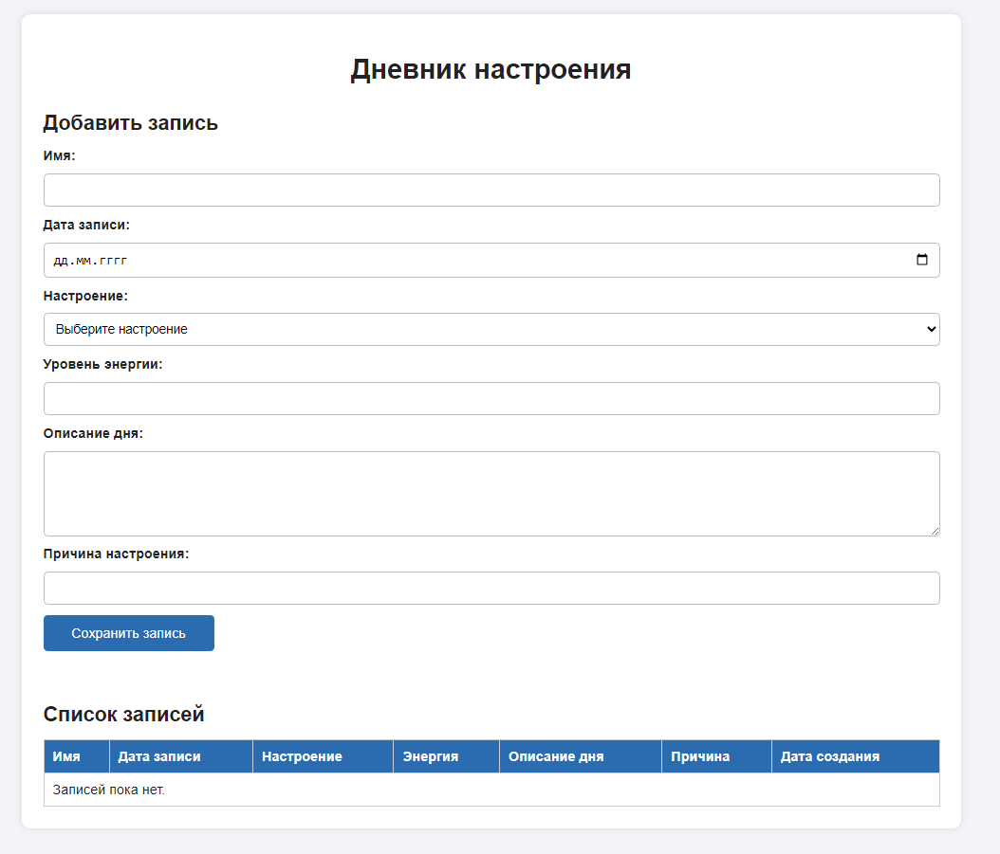
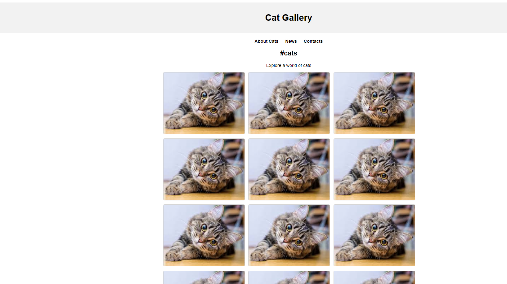

# Лабораторная работа №6
## Дисциплина: PHP

### Тема: Обработка и валидация форм

Выполнил: студент группы IA2403, Демченко Юрий  
Проверила: V. Vișnevschi  
Год: 2026

* * *

## Цель работы

Освоить основные принципы работы с HTML-формами в PHP.

В рамках лабораторной работы необходимо научиться:

* создавать HTML-формы;
* отправлять данные на сервер;
* принимать данные через PHP;
* выполнять валидацию данных;
* сохранять данные в файл;
* выводить сохраненные данные в виде HTML-таблицы;
* использовать объектно-ориентированный подход для организации кода.

---

## Условия работы

Студент должен выбрать тему проекта, которая будет развиваться на протяжении курса.

Для данной лабораторной работы была выбрана тема:

## Дневник настроения

Приложение позволяет пользователю добавлять записи о своем настроении за определенный день.

Пользователь может указать:

* свое имя;
* дату записи;
* настроение;
* уровень энергии;
* описание дня;
* причину настроения;
* дату создания записи.

Данные отправляются через HTML-форму, обрабатываются на сервере, проходят проверку и сохраняются в файл `data.json`.

После этого все записи можно вывести в виде HTML-таблицы.

---

## Шаг 1. Определение модели данных

Для проекта **«Дневник настроения»** была определена следующая модель данных:

| Поле | Тип данных | Описание |
|---|---|---|
| `name` | `string` | Имя пользователя |
| `entry_date` | `date` | Дата записи |
| `mood` | `enum` | Настроение пользователя |
| `energy_level` | `integer` | Уровень энергии от 1 до 10 |
| `description` | `text` | Подробное описание дня |
| `reason` | `string` | Причина такого настроения |
| `created_at` | `date` | Дата создания записи |

В модели данных присутствуют все необходимые типы:

* `string` — поле `name`;
* `date` — поля `entry_date` и `created_at`;
* `enum` — поле `mood`;
* `text` — поле `description`.

Всего используется 7 полей, что соответствует условию лабораторной работы.

---

## Шаг 2. Создание HTML-формы

Для добавления новой записи была создана HTML-форма.

Форма использует метод `POST`, потому что данные отправляются на сервер для обработки.

#### Пример формы

```php
<form action="store.php" method="POST">
    <label for="name">Имя:</label>
    <input 
        type="text" 
        id="name" 
        name="name" 
        required 
        minlength="2" 
        maxlength="50"
    >

    <label for="entry_date">Дата записи:</label>
    <input 
        type="date" 
        id="entry_date" 
        name="entry_date" 
        required
    >

    <label for="mood">Настроение:</label>
    <select id="mood" name="mood" required>
        <option value="">Выберите настроение</option>
        <option value="happy">Хорошее</option>
        <option value="sad">Плохое</option>
        <option value="normal">Обычное</option>
        <option value="angry">Злое</option>
        <option value="tired">Уставшее</option>
    </select>

    <label for="energy_level">Уровень энергии:</label>
    <input 
        type="number" 
        id="energy_level" 
        name="energy_level" 
        min="1" 
        max="10" 
        required
    >

    <label for="description">Описание дня:</label>
    <textarea 
        id="description" 
        name="description" 
        required 
        minlength="10" 
        maxlength="1000"
    ></textarea>

    <label for="reason">Причина настроения:</label>
    <input 
        type="text" 
        id="reason" 
        name="reason" 
        required 
        minlength="3" 
        maxlength="100"
    >

    <button type="submit">Сохранить запись</button>
</form>
```

В форме была добавлена базовая клиентская валидация:

* `required` — обязательное поле;
* `minlength` — минимальная длина текста;
* `maxlength` — максимальная длина текста;
* `min` и `max` — ограничения для числового поля;
* `type="date"` — ввод даты;
* `type="number"` — ввод числа.

Такая валидация помогает пользователю правильно заполнить форму еще до отправки данных на сервер.

---

## Шаг 3. Обработка данных на сервере

Для обработки формы был создан PHP-скрипт `store.php`.

Этот файл выполняет следующие действия:

* принимает данные из массива `$_POST`;
* проверяет корректность введенных данных;
* очищает данные от лишних пробелов;
* защищает данные от HTML-кода;
* сохраняет запись в файл `data.json`;
* выводит сообщение об успешной отправке или об ошибках.

#### Пример обработки данных

```php
<?php

declare(strict_types=1);

$errors = [];

$name = trim($_POST['name'] ?? '');
$entryDate = trim($_POST['entry_date'] ?? '');
$mood = trim($_POST['mood'] ?? '');
$energyLevel = trim($_POST['energy_level'] ?? '');
$description = trim($_POST['description'] ?? '');
$reason = trim($_POST['reason'] ?? '');

$allowedMoods = ['happy', 'sad', 'normal', 'angry', 'tired'];

if ($name === '') {
    $errors[] = 'Имя обязательно для заполнения.';
}

if (strlen($name) < 2) {
    $errors[] = 'Имя должно содержать минимум 2 символа.';
}

if ($entryDate === '') {
    $errors[] = 'Дата записи обязательна.';
}

if (!DateTime::createFromFormat('Y-m-d', $entryDate)) {
    $errors[] = 'Дата имеет неправильный формат.';
}

if (!in_array($mood, $allowedMoods, true)) {
    $errors[] = 'Выбрано некорректное настроение.';
}

if (!is_numeric($energyLevel) || (int)$energyLevel < 1 || (int)$energyLevel > 10) {
    $errors[] = 'Уровень энергии должен быть числом от 1 до 10.';
}

if (strlen($description) < 10) {
    $errors[] = 'Описание дня должно содержать минимум 10 символов.';
}

if ($reason === '') {
    $errors[] = 'Причина настроения обязательна.';
}

if (!empty($errors)) {
    foreach ($errors as $error) {
        echo '<p>' . htmlspecialchars($error) . '</p>';
    }

    exit;
}

$newEntry = [
    'name' => htmlspecialchars($name),
    'entry_date' => $entryDate,
    'mood' => htmlspecialchars($mood),
    'energy_level' => (int)$energyLevel,
    'description' => htmlspecialchars($description),
    'reason' => htmlspecialchars($reason),
    'created_at' => date('Y-m-d H:i:s'),
];

$filePath = 'data.json';

$entries = [];

if (file_exists($filePath)) {
    $jsonData = file_get_contents($filePath);
    $entries = json_decode($jsonData, true) ?? [];
}

$entries[] = $newEntry;

file_put_contents($filePath, json_encode($entries, JSON_PRETTY_PRINT | JSON_UNESCAPED_UNICODE));

echo '<p>Запись успешно сохранена!</p>';
echo '<a href="index.php">Вернуться назад</a>';
```

Данные сохраняются в файл `data.json` в формате JSON.

Формат JSON удобен тем, что данные легко читать, изменять и использовать в дальнейшем.

---

## Шаг 4. Вывод данных

Для вывода сохраненных записей был создан отдельный PHP-скрипт.

Он читает данные из файла `data.json` и выводит их в HTML-таблицу.

Также была добавлена возможность сортировки данных по дате записи, настроению и уровню энергии.

#### Пример вывода данных

```php
<?php

declare(strict_types=1);

$filePath = 'data.json';

$entries = [];

if (file_exists($filePath)) {
    $jsonData = file_get_contents($filePath);
    $entries = json_decode($jsonData, true) ?? [];
}

$sort = $_GET['sort'] ?? 'entry_date';

usort($entries, function (array $a, array $b) use ($sort): int {
    return $a[$sort] <=> $b[$sort];
});
?>

<table border="1" cellpadding="8" cellspacing="0">
    <thead>
        <tr>
            <th><a href="?sort=name">Имя</a></th>
            <th><a href="?sort=entry_date">Дата записи</a></th>
            <th><a href="?sort=mood">Настроение</a></th>
            <th><a href="?sort=energy_level">Энергия</a></th>
            <th>Описание дня</th>
            <th>Причина</th>
            <th><a href="?sort=created_at">Дата создания</a></th>
        </tr>
    </thead>
    <tbody>
        <?php foreach ($entries as $entry): ?>
            <tr>
                <td><?= htmlspecialchars($entry['name']) ?></td>
                <td><?= htmlspecialchars($entry['entry_date']) ?></td>
                <td><?= htmlspecialchars($entry['mood']) ?></td>
                <td><?= htmlspecialchars((string)$entry['energy_level']) ?></td>
                <td><?= htmlspecialchars($entry['description']) ?></td>
                <td><?= htmlspecialchars($entry['reason']) ?></td>
                <td><?= htmlspecialchars($entry['created_at']) ?></td>
            </tr>
        <?php endforeach; ?>
    </tbody>
</table>
```

В таблице отображаются все сохраненные записи.

Для удобства были добавлены ссылки для сортировки:

* по имени;
* по дате записи;
* по настроению;
* по уровню энергии;
* по дате создания.

---

## Шаг 5. Дополнительная функция

Для получения максимальной оценки была выбрана дополнительная функция:

## ООП-реализация

Решение было организовано с использованием объектно-ориентированного программирования.

Были созданы следующие классы:

* `MoodEntry` — описывает одну запись дневника настроения;
* `MoodEntryValidator` — отвечает за валидацию данных формы;
* `MoodEntryStorage` — отвечает за сохранение и чтение данных из файла;
* `MoodEntryTableRenderer` — отвечает за вывод данных в HTML-таблицу.

Также был создан интерфейс:

* `ValidatorInterface` — общий интерфейс для валидаторов.

---

## Интерфейс `ValidatorInterface`

Интерфейс нужен для того, чтобы все валидаторы имели одинаковую структуру.

#### Пример кода

```php
interface ValidatorInterface
{
    public function validate(array $data): array;
}
```

Метод `validate()` принимает массив данных и возвращает массив ошибок.

Если ошибок нет, возвращается пустой массив.

---

## Класс `MoodEntry`

Класс `MoodEntry` описывает одну запись дневника настроения.

#### Пример кода

```php
class MoodEntry
{
    public function __construct(
        private string $name,
        private string $entryDate,
        private string $mood,
        private int $energyLevel,
        private string $description,
        private string $reason,
        private string $createdAt
    ) {
    }

    public function toArray(): array
    {
        return [
            'name' => $this->name,
            'entry_date' => $this->entryDate,
            'mood' => $this->mood,
            'energy_level' => $this->energyLevel,
            'description' => $this->description,
            'reason' => $this->reason,
            'created_at' => $this->createdAt,
        ];
    }
}
```

В классе используется конструктор, через который передаются все данные записи.

Метод `toArray()` преобразует объект в массив, чтобы его можно было сохранить в JSON-файл.

---

## Класс `MoodEntryValidator`

Класс `MoodEntryValidator` проверяет данные, отправленные из формы.

Он реализует интерфейс `ValidatorInterface`.

#### Пример кода

```php
class MoodEntryValidator implements ValidatorInterface
{
    public function validate(array $data): array
    {
        $errors = [];

        $allowedMoods = ['happy', 'sad', 'normal', 'angry', 'tired'];

        if (empty($data['name'])) {
            $errors[] = 'Имя обязательно для заполнения.';
        }

        if (strlen($data['name'] ?? '') < 2) {
            $errors[] = 'Имя должно содержать минимум 2 символа.';
        }

        if (empty($data['entry_date'])) {
            $errors[] = 'Дата записи обязательна.';
        }

        if (!DateTime::createFromFormat('Y-m-d', $data['entry_date'] ?? '')) {
            $errors[] = 'Дата имеет неправильный формат.';
        }

        if (!in_array($data['mood'] ?? '', $allowedMoods, true)) {
            $errors[] = 'Выбрано некорректное настроение.';
        }

        if (
            !isset($data['energy_level']) ||
            !is_numeric($data['energy_level']) ||
            (int)$data['energy_level'] < 1 ||
            (int)$data['energy_level'] > 10
        ) {
            $errors[] = 'Уровень энергии должен быть числом от 1 до 10.';
        }

        if (strlen($data['description'] ?? '') < 10) {
            $errors[] = 'Описание дня должно содержать минимум 10 символов.';
        }

        if (empty($data['reason'])) {
            $errors[] = 'Причина настроения обязательна.';
        }

        return $errors;
    }
}
```

Этот класс отделяет проверку данных от основного файла.

Такой подход делает код более аккуратным и понятным.

---

## Класс `MoodEntryStorage`

Класс `MoodEntryStorage` отвечает за сохранение и чтение данных.

#### Пример кода

```php
class MoodEntryStorage
{
    public function __construct(
        private string $filePath
    ) {
    }

    public function save(MoodEntry $entry): void
    {
        $entries = $this->getAll();

        $entries[] = $entry->toArray();

        file_put_contents(
            $this->filePath,
            json_encode($entries, JSON_PRETTY_PRINT | JSON_UNESCAPED_UNICODE)
        );
    }

    public function getAll(): array
    {
        if (!file_exists($this->filePath)) {
            return [];
        }

        $jsonData = file_get_contents($this->filePath);

        return json_decode($jsonData, true) ?? [];
    }
}
```

Метод `save()` сохраняет новую запись в файл.

Метод `getAll()` читает все записи из файла и возвращает массив.

---

## Класс `MoodEntryTableRenderer`

Класс `MoodEntryTableRenderer` отвечает за отображение записей в HTML-таблице.

#### Пример кода

```php
final class MoodEntryTableRenderer
{
    public function render(array $entries): string
    {
        $html = '<table border="1" cellpadding="8" cellspacing="0">';
        $html .= '<thead>';
        $html .= '<tr>';
        $html .= '<th>Имя</th>';
        $html .= '<th>Дата записи</th>';
        $html .= '<th>Настроение</th>';
        $html .= '<th>Энергия</th>';
        $html .= '<th>Описание</th>';
        $html .= '<th>Причина</th>';
        $html .= '<th>Дата создания</th>';
        $html .= '</tr>';
        $html .= '</thead>';
        $html .= '<tbody>';

        foreach ($entries as $entry) {
            $html .= '<tr>';
            $html .= '<td>' . htmlspecialchars($entry['name']) . '</td>';
            $html .= '<td>' . htmlspecialchars($entry['entry_date']) . '</td>';
            $html .= '<td>' . htmlspecialchars($entry['mood']) . '</td>';
            $html .= '<td>' . htmlspecialchars((string)$entry['energy_level']) . '</td>';
            $html .= '<td>' . htmlspecialchars($entry['description']) . '</td>';
            $html .= '<td>' . htmlspecialchars($entry['reason']) . '</td>';
            $html .= '<td>' . htmlspecialchars($entry['created_at']) . '</td>';
            $html .= '</tr>';
        }

        $html .= '</tbody>';
        $html .= '</table>';

        return $html;
    }
}
```

Класс отвечает только за вывод данных.

Он не занимается обработкой формы, валидацией или сохранением.

---

## Результат работы






В результате выполнения лабораторной работы было создано PHP-приложение **«Дневник настроения»**.

Приложение позволяет:

* заполнить HTML-форму;
* отправить данные методом `POST`;
* обработать данные на сервере;
* проверить корректность введенных данных;
* сохранить запись в файл `data.json`;
* вывести все записи в виде HTML-таблицы;
* сортировать записи по разным полям.

Также была реализована ООП-структура приложения, благодаря которой код стал более понятным и удобным для расширения.

---

# Контрольные вопросы

## 1. Какие существуют методы отправки данных из формы на сервер? Какие методы поддерживает HTML-форма?

HTML-форма поддерживает два основных метода отправки данных:

* `GET`;
* `POST`.

Метод `GET` передает данные через адресную строку браузера.

Например:

```text
site.com/index.php?name=Yurii&mood=happy
```

Этот метод удобно использовать для поиска, фильтрации и сортировки данных.

Но `GET` не подходит для отправки конфиденциальной информации, потому что данные видны в URL.

Метод `POST` передает данные в теле HTTP-запроса.

Этот метод чаще используется для форм регистрации, авторизации, добавления записей и отправки больших объемов данных.

В данной лабораторной работе использовался метод `POST`, потому что пользователь отправляет данные дневника настроения на сервер для сохранения.

---

## 2. Какие глобальные переменные используются для доступа к данным формы в PHP?

В PHP для доступа к данным формы используются суперглобальные массивы.

Основные из них:

* `$_GET`;
* `$_POST`;
* `$_REQUEST`;
* `$_FILES`.

Массив `$_GET` используется для получения данных, отправленных методом `GET`.

Массив `$_POST` используется для получения данных, отправленных методом `POST`.

Массив `$_REQUEST` может содержать данные из `$_GET`, `$_POST` и `$_COOKIE`.

Массив `$_FILES` используется для обработки загруженных файлов.

В данной лабораторной работе использовался массив `$_POST`.

Пример:

```php
$name = $_POST['name'] ?? '';
$mood = $_POST['mood'] ?? '';
```

Оператор `??` нужен для того, чтобы избежать ошибки, если такого поля нет в массиве.

---

## 3. Как обеспечить безопасность при обработке данных из формы, например защититься от XSS?

XSS — это атака, при которой пользователь может отправить вредоносный JavaScript-код через форму.

Например, вместо обычного имени пользователь может ввести:

```html
<script>alert('Ошибка')</script>
```

Если вывести такие данные на страницу без обработки, браузер может выполнить этот код.

Чтобы защититься от XSS, нужно использовать функцию `htmlspecialchars()`.

Пример:

```php
echo htmlspecialchars($entry['name']);
```

Эта функция преобразует специальные HTML-символы в безопасный вид.

Например, символ `<` будет преобразован в `&lt;`.

Также для безопасности нужно:

* проверять все данные на сервере;
* не доверять данным из `$_POST`;
* использовать `trim()` для удаления лишних пробелов;
* проверять длину строк;
* проверять формат даты;
* проверять допустимые значения для `enum`;
* использовать `filter_var()` там, где это нужно;
* не выводить данные пользователя без обработки.

В данной лабораторной работе для защиты данных используется функция `htmlspecialchars()`.

---

## Вывод

В данной лабораторной работе я изучил обработку и валидацию HTML-форм в PHP.

Я создал форму для проекта **«Дневник настроения»**, которая позволяет пользователю добавить запись о своем настроении.

В ходе работы были использованы:

* HTML-форма;
* метод `POST`;
* массив `$_POST`;
* клиентская валидация через HTML-атрибуты;
* серверная валидация через PHP;
* сохранение данных в файл `data.json`;
* чтение данных из файла;
* вывод данных в HTML-таблицу;
* сортировка данных;
* защита от XSS с помощью `htmlspecialchars()`.

Также была реализована дополнительная часть с использованием объектно-ориентированного программирования.

Были созданы отдельные классы для записи, валидации, хранения данных и вывода таблицы.

В результате получилось простое PHP-приложение, которое принимает данные из формы, проверяет их, сохраняет и отображает пользователю.
